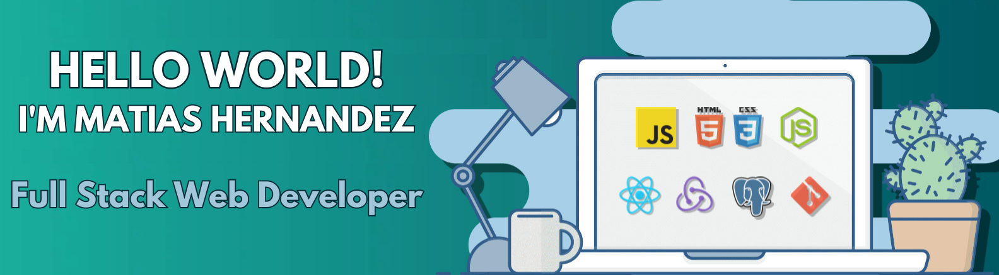

</img>
   
<h1 align="center">Hi 👋, I'm Matias Nicolas Hernandez</h1>
<h3 align="center">Full stack web development</h3>

- 🔭 I’m currently working on **personal projects to gain experience**

- 🌱 I’m currently learning **Next.JS for React, and Java for the university**

- 👨‍💻 All of my projects are available at [https://www.linkedin.com/in/matiashernandez00/](https://www.linkedin.com/in/matiashernandez00/)

- 📫 How to reach me **matias2k00@gmail.com**

## 🌐 Socials:
 

                                                                                    

<h3 align="left">Languages and Tools:</h3>

                 

  
 

 <h3 align="center">NUNCA MUCHO, COSTÓ POCO</h3>
